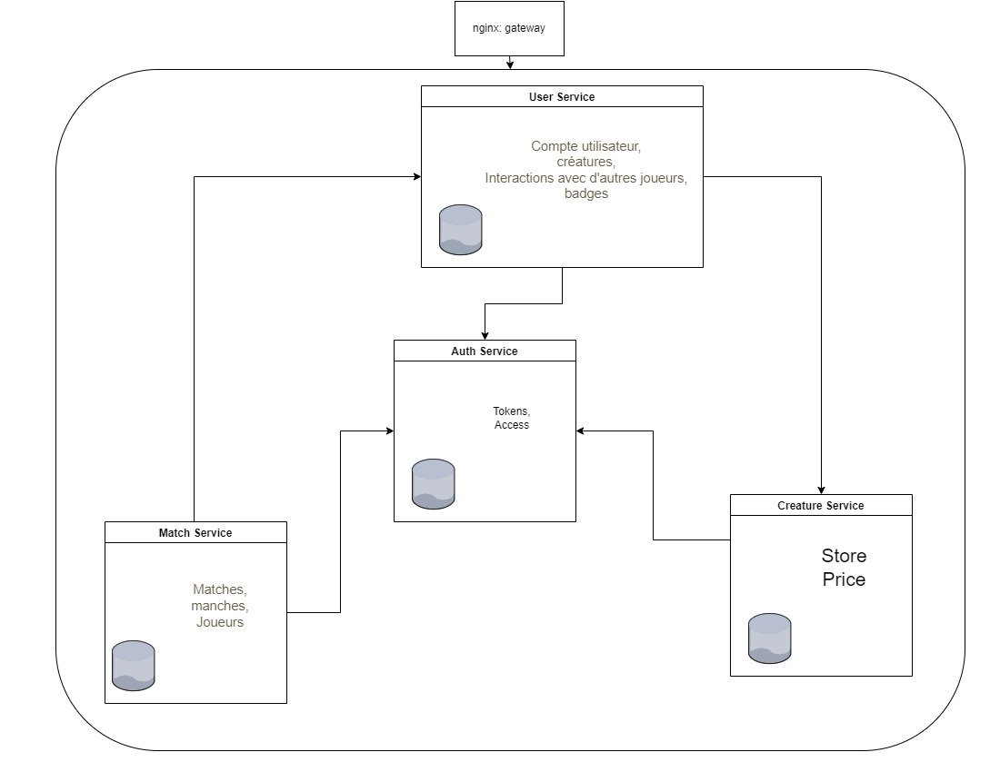

# ChampionSphere
A poke-API like microservice application developed with Fastify by Mohamed Dallel & Firas Yahyaoui.
# Run application:
- Install docker & docker compose
- run "docker compose up -d"
- test the APIs and enjoy at localhost:8080 (check the OpenAPI docs to see different endpoints)
- You can also import the Postman collection to test APIs. Make sure to change the token in the authorization header after logging in.

# Architecture

- You can access the API gateway at http://localhost:8080/api/user to go to the user microservice endpoints, http://localhost:8080/api/user/match to go to the match microservice endpoints etc...

# Next steps
- Add badges feature
- Add other match modes by adding more objects that implement the Game interface in the match microservice, and integrate mode selection more when creating the match
- Add the possibility to play a solo match against AI.
- Add a matchmaking feature.
- Add the possibility to play in teams.
- Add a frontend to facilitate usage